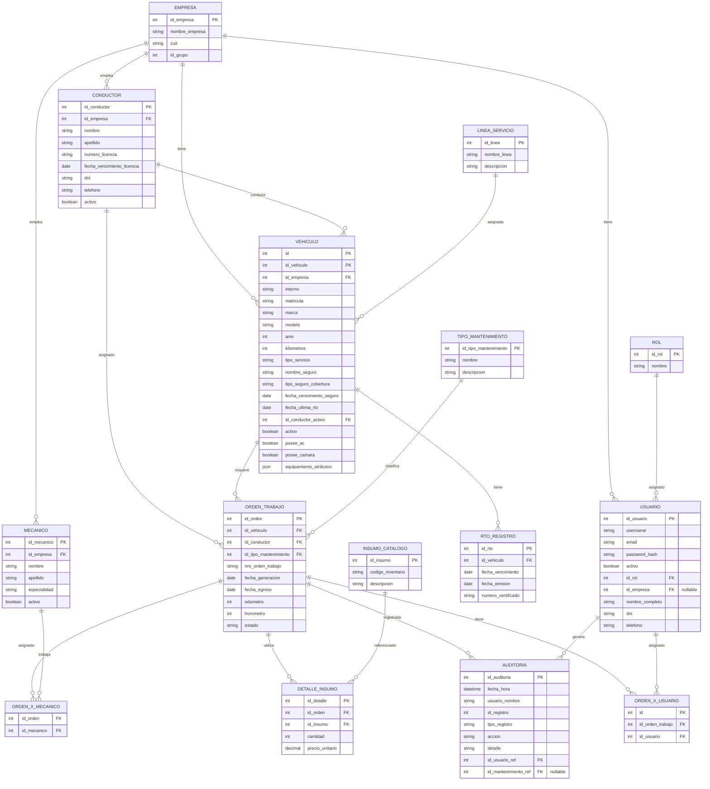

# Diagrama de Entidad-Relación (DER) - Sistema EMOP

## Descripción de Relaciones

### Relaciones Principales:

1. **EMPRESA → VEHICULO** (1:N)
   - Una empresa puede tener múltiples vehículos
   - Clave foránea: `vehiculo.id_empresa`

2. **EMPRESA → CONDUCTOR** (1:N)
   - Una empresa emplea múltiples conductores
   - Clave foránea: `conductor.id_empresa`

3. **EMPRESA → MECANICO** (1:N)
   - Una empresa emplea múltiples mecánicos
   - Clave foránea: `mecanico.id_empresa`

4. **EMPRESA → USUARIO** (1:N)
   - Una empresa puede tener múltiples usuarios (opcional, nullable)
   - Clave foránea: `usuario.id_empresa` (nullable)

5. **CONDUCTOR → VEHICULO** (1:N)
   - Un conductor puede estar asignado a múltiples vehículos (conductor activo)
   - Clave foránea: `vehiculo.id_conductor_activo`

7. **CONDUCTOR → ORDEN_TRABAJO** (1:N)
   - Un conductor puede tener múltiples órdenes de trabajo asignadas
   - Clave foránea: `orden_trabajo.id_conductor`

8. **VEHICULO → ORDEN_TRABAJO** (1:N)
   - Un vehículo puede tener múltiples órdenes de trabajo
   - Clave foránea: `orden_trabajo.id_vehiculo`

9. **VEHICULO → RTO_REGISTRO** (1:N)
   - Un vehículo puede tener múltiples registros RTO
   - Clave foránea: `rto_registro.id_vehiculo`

10. **TIPO_MANTENIMIENTO → ORDEN_TRABAJO** (1:N)
    - Un tipo de mantenimiento puede clasificar múltiples órdenes
    - Clave foránea: `orden_trabajo.id_tipo_mantenimiento`

11. **ORDEN_TRABAJO → ORDEN_X_MECANICO** (1:N)
    - Una orden de trabajo puede tener múltiples mecánicos asignados (relación muchos a muchos)
    - Tabla intermedia: `orden_x_mecanico`

12. **MECANICO → ORDEN_X_MECANICO** (1:N)
    - Un mecánico puede trabajar en múltiples órdenes (relación muchos a muchos)
    - Tabla intermedia: `orden_x_mecanico`

13. **ORDEN_TRABAJO → DETALLE_INSUMO** (1:N)
    - Una orden de trabajo puede utilizar múltiples insumos
    - Clave foránea: `detalle_insumo.id_orden`

14. **INSUMO_CATALOGO → DETALLE_INSUMO** (1:N)
    - Un insumo del catálogo puede ser utilizado en múltiples detalles
    - Clave foránea: `detalle_insumo.id_insumo`

15. **ROL → USUARIO** (1:N)
    - Un rol puede ser asignado a múltiples usuarios
    - Clave foránea: `usuario.id_rol`

16. **USUARIO → AUDITORIA** (1:N)
    - Un usuario puede generar múltiples registros de auditoría
    - Clave foránea: `auditoria.id_usuario_ref`

17. **ORDEN_TRABAJO → AUDITORIA** (1:N)
    - Una orden de trabajo puede tener múltiples registros de auditoría
    - Clave foránea: `auditoria.id_mantenimiento_ref` (nullable)

18. **LINEA_SERVICIO → VEHICULO** (1:N)
    - Una línea de servicio puede tener múltiples vehículos asignados
    - Relación implícita a través de atributos del vehículo

19. **ORDEN_TRABAJO → ORDEN_X_USUARIO** (1:N)
    - Una orden de trabajo puede tener múltiples usuarios asignados (inspector, auditor, etc.)
    - Tabla intermedia: `orden_x_usuario`
    - Clave foránea: `orden_x_usuario.id_orden_trabajo`
    - Cada registro representa la asignación de un usuario específico a una orden de trabajo
    - El rol del usuario (inspector, auditor, etc.) se determina por su `id_rol` en la tabla `USUARIO`

20. **USUARIO → ORDEN_X_USUARIO** (1:N)
    - Un usuario puede ser asignado a múltiples órdenes de trabajo
    - Clave foránea: `orden_x_usuario.id_usuario`
    - La relación permite que un mismo usuario pueda tener diferentes roles en diferentes órdenes
    - El rol específico (inspector, auditor) se identifica mediante la relación del usuario con su `ROL` correspondiente

## Notas Importantes:

- **Claves Primarias (PK)**: Identificadores únicos de cada entidad
- **Claves Foráneas (FK)**: Referencias a otras entidades
- **Nullable**: Campos que pueden ser nulos (opcionales)
- **Relación Muchos a Muchos**: 
  - `ORDEN_TRABAJO` y `MECANICO` se relacionan a través de la tabla intermedia `ORDEN_X_MECANICO`
  - `ORDEN_TRABAJO` y `USUARIO` se relacionan a través de la tabla intermedia `ORDEN_X_USUARIO`
- **Asignación de Usuarios a Órdenes**: 
  - La tabla `ORDEN_X_USUARIO` permite asignar múltiples usuarios a una misma orden de trabajo
  - Cada registro representa una asignación individual (por ejemplo, un inspector y un auditor pueden estar asignados a la misma orden mediante dos registros separados)
  - El rol del usuario (inspector con `id_rol = 3`, auditor con `id_rol = 4`) se determina consultando la tabla `USUARIO` y su relación con `ROL`

## Cómo visualizar este diagrama:

1. **Online**: Copia el código Mermaid y pégalo en [Mermaid Live Editor](https://mermaid.live/)
2. **VS Code**: Instala la extensión "Markdown Preview Mermaid Support"
3. **GitHub/GitLab**: Se renderiza automáticamente en archivos `.md`
4. **Exportar**: Desde Mermaid Live Editor puedes exportar como PNG, SVG o PDF
